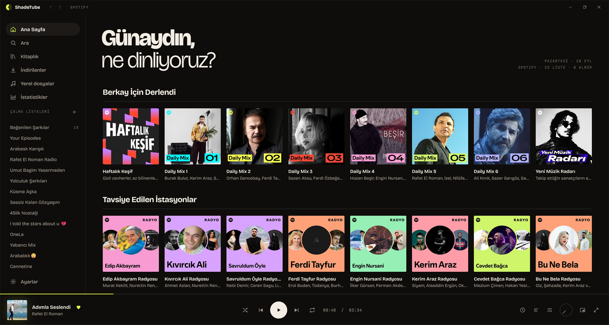
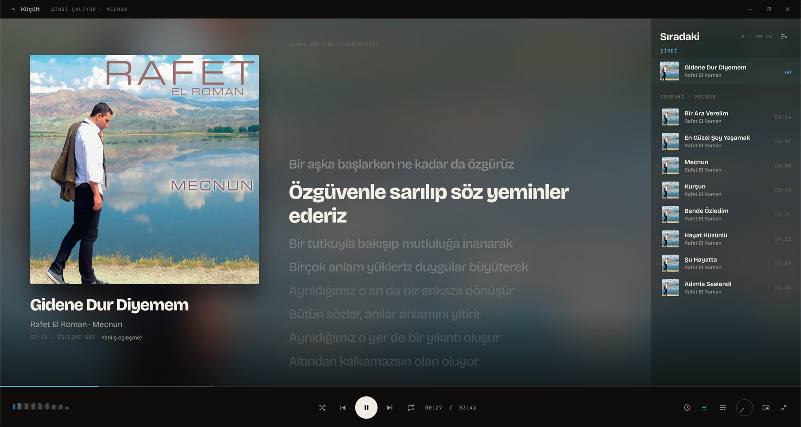
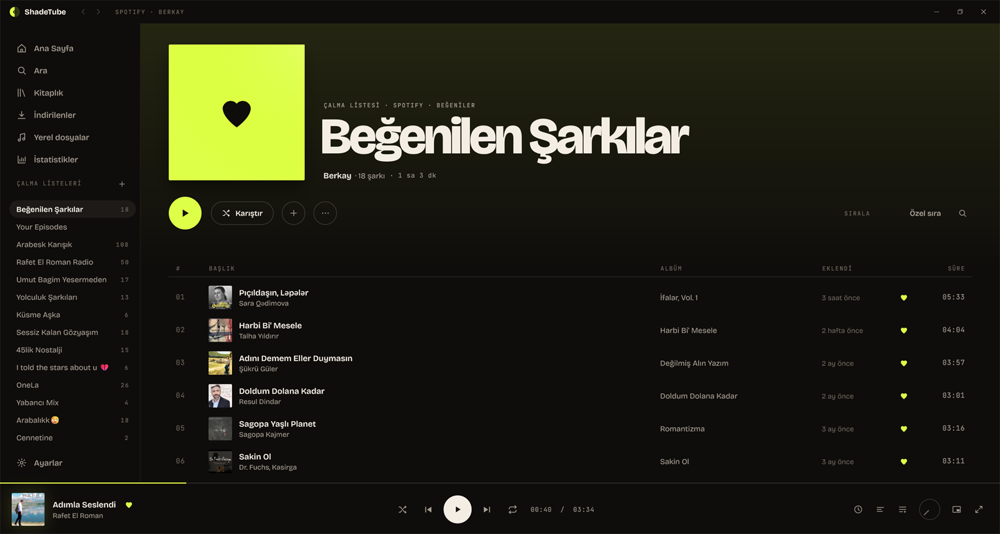
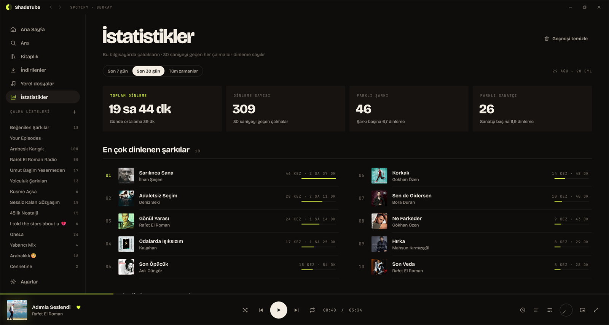
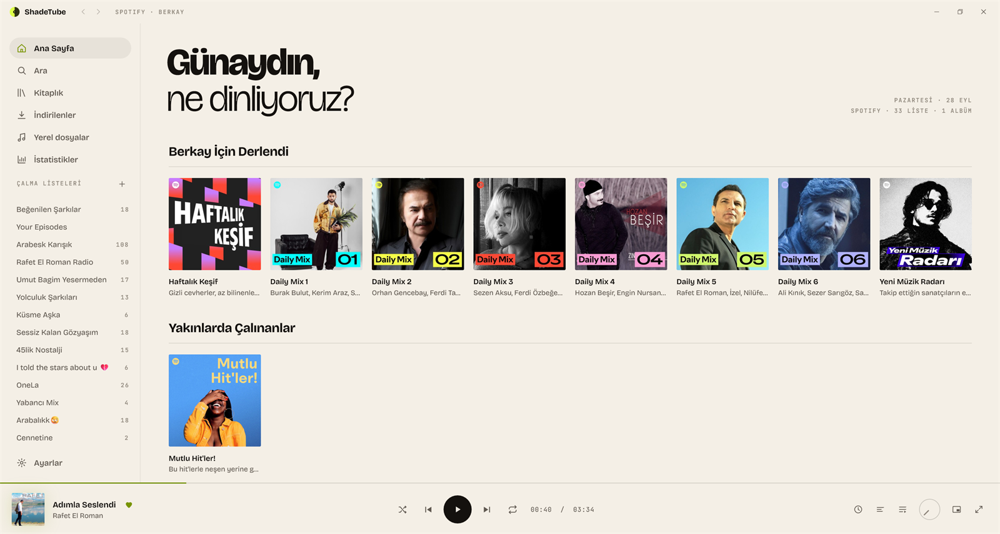
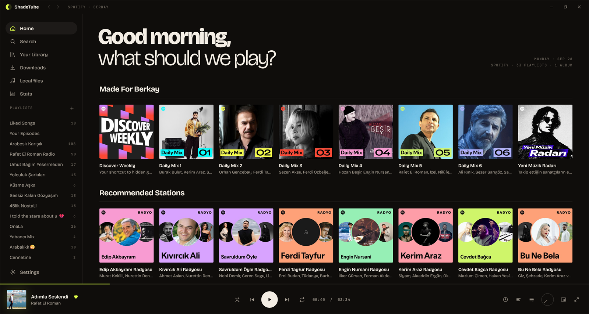
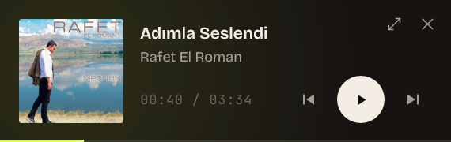

<div align="center">


# ShadeTube

**Spotify kitaplığın, YouTube'dan çalan sesle — hızlı, yerel bir Windows uygulamasında.**<br/>
Reklam yok. Premium yok. Electron yok. Sıfırdan C++ ile yazılmış, birkaç MB'lık tek bir exe.

[](https://github.com/shadesofdeath/ShadeTube/releases/latest)
[](https://github.com/shadesofdeath/ShadeTube/releases)
[](#-indir)
[](LICENSE)

[**İndir**](https://github.com/shadesofdeath/ShadeTube/releases/latest) ·
[Özellikler](#-özellikler) ·
[Ekran görüntüleri](#-ekran-görüntüleri) ·
[SSS](#-sss) ·
[Kaynaktan derleme](docs/DEVELOPMENT.md) ·
[English](README.md)



</div>

---

ShadeTube, [Spotube](https://github.com/KRTirtho/spotube)'dan ilham alan bir Windows müzik çalar. Spotify hesabınla
giriş yaparsın; kitaplığın, çalma listelerin ve sana özel ana sayfan gelir, her şarkı eşleşen YouTube kaydından
çalar. Bir pencereye gömülmüş web sayfası değildir: arayüzün tamamı Direct2D ile çizilir, anında açılır ve hafif
kalır.

## ✨ Özellikler

- 🎧 **Spotify kitaplığın** — çalma listeleri, Beğenilen Şarkılar, kayıtlı albümler, takip ettiğin sanatçılar ve
  kişisel ana sayfa (Daily Mix'ler, Haftalık Keşif, Yakınlarda Çalınanlar), liste klasörlerinle birlikte. Beğenme,
  kaydetme, takip ve liste düzenleme doğrudan hesabına yazılır.
- 🖱️ **Sürükle bırak** — şarkıları bir listeye, Beğenilen Şarkılar'a ya da sıraya sürükle; Explorer'dan müzik
  dosyası ve klasör bırak, hemen çalsın.
- 🚫 **Reklam ve Premium yok** — ses YouTube'dan, otomatik eşleşmeyle gelir; yanlışsa "Yanlış eşleşme?" ile başka
  bir video seçersin.
- 📻 **Radyo ve sonsuz çalma** — şarkıdan, sanatçıdan, albümden ya da listeden radyo başlat; sıra bitince benzer
  şarkılarla devam eder.
- 📡 **İnternet radyosu** — radio-browser.info'dan türe, ülkeye ya da ada göre binlerce canlı istasyon; favoriler ve o
  an çalan şarkı.
- 🎚️ **Ses** — hazır ayarlı 10 bantlı ekolayzer, şarkılar arası geçiş (albümler kesintisiz kalır), her şarkıyı aynı
  seviyede çalan ses dengeleme ve çıkış aygıtı seçimi.
- ⛔ **Kara liste** — engellediğin şarkı ve sanatçılar kendiliğinden hiç çalmaz.
- ⬇️ **Gerçek MP3 indirme** — etiketli ve kapaklı 320 kbps MP3 (ya da orijinal m4a), Sanatçı/Albüm klasörlerine;
  videodaki müzik dışı bölümler SponsorBlock ile kesilir. İndirilenler çevrimdışı çalar; Beğenilen Şarkılar,
  çalma listeleri ve albümler kendiliğinden indirilip güncel tutulabilir.
- 📁 **Yerel dosyalar** — kendi klasörlerin: MP3, FLAC, M4A/ALAC, AAC, WAV ve WMA, etiket ve kapaklarıyla.
- 🎙️ **Podcastler** — Apple Podcasts dizininde ara ya da herhangi bir RSS beslemesini ekle; abone ol, yeni bölümleri
  gör, kaldığın yerden devam et, bölüm notlarını oku ve bölümleri çevrimdışı dinlemek için indir.
- 🎤 **Senkron şarkı sözleri** — LRCLIB'den, Spotify'a bağlıyken Spotify'dan ya da kendi `.lrc` dosyalarından; bir
  satıra tıkla, oraya atla, zamanlama kaymışsa düzelt ya da sözleri söylendikçe dolduran tam ekran karaoke
  görünümünü aç. İndirilenlerin etiketine sözler yazılır, yanlarına `.lrc` kaydedilir.
- 📊 **İstatistikler** — gerçek dinleme süren; son 7 gün, 30 gün ya da tüm zamanların en çok dinlenenleri,
  yıl özeti, dinleme saatlerin (ısı haritası) ve Spotify'ın veri indirmesinden içe aktarılan geçmişin.
- ✨ **Senin için listeler** — birlikte dinlediğin sanatçılardan günün karışımları (araya yeni şarkılar katılır), bu
  ayın favorileri, yeni keşiflerin, unutulan beğeniler, tüm zamanların ve her yılın en iyileri: kendi dinlediklerinden
  bilgisayarında oluşan, her gün yenilenen listeler.
- ⏭️ **SponsorBlock** — çalarken konuşma, sponsor ve tanıtım bölümlerini atlar.
- 🪟 **Windows'a tam uyum** — medya tuşları ve kilit ekranı kontrolleri, görev çubuğu düğmeleri ve ilerlemesi,
  her zaman üstte mini oynatıcı, sistem tepsisi, koyu / açık / sistem teması, Windows ile başlatma (istersen tepside).
- ⌨️ **Klavyeyle her şey** — her şeye ulaşan komut paleti (Ctrl+K), tam klavye desteği, değiştirilebilir kısayollar
  ve uygulama arka plandayken de çalışan isteğe bağlı genel kısayollar.
- 🔗 **Scrobble ve durum** — Last.fm, ListenBrainz ve Discord'da "dinliyor" (isteğe bağlı).
- 📋 **Bağlantı yapıştır** — Ara'ya (ya da her yerde Ctrl+V ile) yapıştırdığın Spotify, YouTube veya MusicBrainz
  bağlantısı albümü, listeyi ya da sanatçıyı açar; şarkıyı veya videoyu çalar.
- 🛟 **Yedek ses kaynağı** — YouTube çalışmazsa Piped ya da Invidious (varsayılan olarak kapalı).
- 🌍 **11 dil** — Türkçe, English, Deutsch, Español, Français, Português (BR), Русский, Українська,
  Bahasa Indonesia, 日本語, 한국어.
- ⚡ **Hafif ve kendini güncelleyen** — kurmadan çalışan yaklaşık 8 MB'lık tek bir exe; istersen tek tıkla kurulur
  (yönetici izni gerekmez), yeni sürümler uygulama içinden güncellenir.
- 🔒 **Gizlilik** — telemetri yok, bizim bir sunucumuz yok. Spotify oturumun Windows DPAPI ile şifreli saklanır.

## 📸 Ekran görüntüleri

| | |
|---|---|
|  |  |
| **Şimdi Çalıyor** — senkron sözler ve sıra | **Çalma listeleri** — Spotify'daki Beğenilen Şarkılar |
|  |  |
| **İstatistikler** — en çok dinlenenler (örnek veri) | **Açık tema** |
|  |  |
| **11 dil** — burada İngilizce | **Mini oynatıcı** — her zaman üstte |

## ⬇ İndir

1. [Son sürümden](https://github.com/shadesofdeath/ShadeTube/releases/latest) **`ShadeTube-<sürüm>-win64.zip`**
   dosyasını indir ve bir klasöre çıkar.
2. **`ShadeTube.exe`**'yi çalıştır. Exe henüz imzalı olmadığı için Windows SmartScreen "bilinmeyen yayımcı"
   uyarısı verebilir: **Ek bilgi → Yine de çalıştır**.
3. **Spotify ile bağlan**'a tıklayıp hesabınla giriş yap (e-posta, Google ya da Apple) ya da
   **Spotify olmadan keşfet** ile açık MusicBrainz kataloğunu gez.

**Ya da bir paket yöneticisiyle:**

```powershell
scoop bucket add shadetube https://github.com/shadesofdeath/ShadeTube
scoop install shadetube/shadetube
winget install shadesofdeath.ShadeTube   # paket winget'e kabul edildikten sonra
```

İsteğe bağlı: **Ayarlar → Hakkında → Bilgisayara kur**, ShadeTube'u Başlat menüsüne ve Windows'un yüklü
uygulamalarına ekler (kullanıcı bazında, yönetici izni gerekmez). Güncellemeler günde bir kez denetlenir ve tek
tıkla kurulur.

**Gereksinimler:** Windows 10 (1809 ve sonrası) ya da Windows 11, 64 bit. Spotify girişi için Microsoft Edge
WebView2 Runtime gerekir; Windows 11'de hazır gelir ([Windows 10 için indir](https://developer.microsoft.com/microsoft-edge/webview2/)).

## ❓ SSS

**Spotify Premium gerekir mi?** Hayır. Spotify kitaplığını ve bilgileri verir; ses YouTube'dan çalar.

**Şifrem güvende mi?** Giriş, bir WebView2 penceresinde Spotify'ın kendi sayfasında yapılır; ShadeTube şifreni hiç
görmez. Yalnızca Spotify'ın koyduğu oturum çerezini, Windows DPAPI ile şifreleyip `%LOCALAPPDATA%\ShadeTube`
içinde saklar. **Ayarlar → Spotify → Çıkış yap** onu siler.

**Bir şarkı yanlış sürümden çalıyor.** Sağ tıkla → **YouTube kaynağını değiştir** ya da Şimdi Çalıyor ekranında
**Yanlış eşleşme?**. Seçimin hatırlanır.

**Dosyalarım nerede?** Ayarlar, kitaplık ve önbellek: `%LOCALAPPDATA%\ShadeTube`. İndirilenler:
`Müzik\ShadeTube\Sanatçı\Albüm\`. Çökme raporları (hiçbir yere gönderilmez): `%LOCALAPPDATA%\ShadeTube\crashes`.

**Nasıl kaldırırım?** Kurduysan: Windows Ayarlar → Uygulamalar → Yüklü uygulamalar → ShadeTube → Kaldır.
Taşınabilir kullanımda: `ShadeTube.exe`'yi ve `%LOCALAPPDATA%\ShadeTube` klasörünü sil.

## 🔒 Gizlilik

ShadeTube'un sunucusu yoktur ve hiçbir veri toplamaz. Doğrudan şunlarla konuşur: Spotify (kitaplığın ve LRCLIB'de
olmayan sözler), YouTube (ses), LRCLIB (sözler), SponsorBlock (bölümler; video açık edilmeden, hash önekiyle
sorulur), MusicBrainz / Cover Art Archive / ListenBrainz (açık katalog) ve GitHub (güncelleme denetimi). Podcastler,
Apple'ın podcast dizinini (arama ve listeler) ve her programın kendi besleme ve ses sunucusunu yalnızca sen açınca
kullanır; internet radyosu radio-browser.info'yu ve istasyonların kendisini kullanır. Last.fm, ListenBrainz scrobble,
Discord ve Piped / Invidious yalnızca sen açarsan kullanılır.

## 🛠 Kaynaktan derleme

*Desktop development with C++* bileşeniyle Visual Studio 2022 veya daha yenisi, ardından:

```bat
build.bat Release
```

Tek exe `build\Release\bin\ShadeTube.exe` olarak çıkar. Mimari, kurallar, testler ve sürüm yayınlama
[docs/DEVELOPMENT.md](docs/DEVELOPMENT.md)'de; sürüm notları [CHANGELOG.md](CHANGELOG.md)'de. Çeviriler
[`assets/i18n`](assets/i18n) klasöründe (anahtar Türkçe metindir) — düzeltmelere açığız.

## ⚖️ Yasal uyarı

ShadeTube bağımsız bir projedir; Spotify, YouTube, Google ya da bağlandığı diğer servislerle bir bağlantısı
yoktur ve onlar tarafından desteklenmez. Tüm markalar sahiplerine aittir. Spotify'ın web oynatıcı uç noktalarını
resmî olmayan yoldan kullanır — kullanım sorumluluğu sana aittir; kullandığın servislerin koşullarına ve
sanatçıların haklarına saygı göster.

## 🙏 Teşekkürler

Fikir için [Spotube](https://github.com/KRTirtho/spotube) ·
C++ akış kütüphanesinin tasarımını izlediği [YoutubeExplode](https://github.com/Tyrrrz/YoutubeExplode) ·
[LRCLIB](https://lrclib.net) · [SponsorBlock](https://sponsor.ajay.app) ·
[MusicBrainz](https://musicbrainz.org) ve [ListenBrainz](https://listenbrainz.org) ·
[nlohmann/json](https://github.com/nlohmann/json) ·
[Bricolage Grotesque](https://github.com/ateliertriay/bricolage) ve [JetBrains Mono](https://github.com/JetBrains/JetBrainsMono) yazı tipleri.
Ayrıntılar: [THIRD_PARTY_NOTICES.md](THIRD_PARTY_NOTICES.md).

## 📄 Lisans

[BSD 4-Clause](LICENSE) © shadesofdeath
